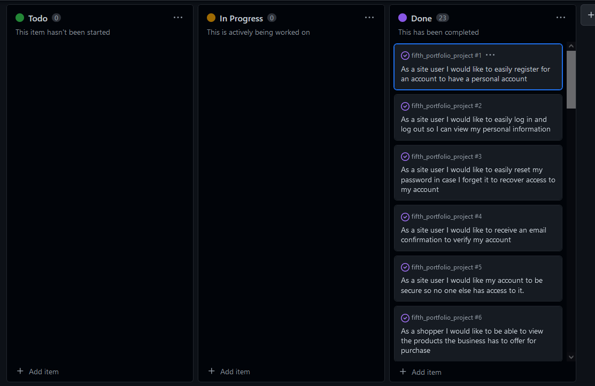
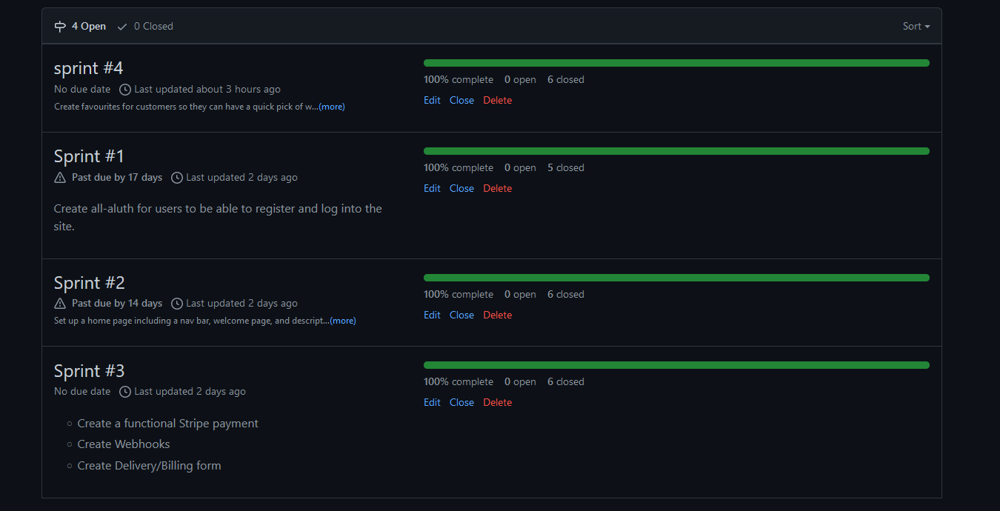

#Taste of Italy

## Purpose of the project

The purpose of this project was to build a Full-Stack site based on business logic used to control a centrally-owned dataset. Aim was to set up an authentication mechanism and provide paid access to the site's data and/or other activities based on the dataset, such as the purchase of a product

## Wireframes
- [Home page](readme_media/wireframe1.PNG) For the front page, not much has changed during the production from the original idea apart from some layout changes.
- [Menu](readme_media/wireframe2.PNG) The menu has stayed as planned from the beginning, however, I removed the checkout box as it was causing a lot of responsive issues with the menu cards
-[Checkout](readme_media/wireframe3.PNG) The check out has stayed true to the wireframe plan, a simple form with details of the order next to the form.
- A lot of desing change has happened during the building of the website as I was heavily influenced by a templated, but tried to stay with original desings.

## Agile Methodology
- While working on this project I used Agile tools provided by github such as the project board, which helped focus on prioritising and seeing what user stories are left to do, in progress or done.

- Another tool that I used was the Milestones that can be set in github, by creating the milestones I was able to group certain user stories together that worked along each other and allowed me to focus on particular side of the design 

## User stories and their features
(User stories can be accessed by clicking user stories id number)

-As a site user I would like to easily register for an account to have a personal account #1
-As a site user I would like to easily log in and log out so I can view my personal information #2
-As a site user I would like to easily reset my password in case I forget it to recover access to my account #3
-As a site user I would like to receive an email confirmation to verify my account#4
-As a site user I would like my account to be secure so no one else has access to it #5
-As a shopper I would like to be able to view the products the business has to offer for purchase #6
-As a shopper I would like to able to see the details of individual products#7
-As a shopper I would like to easily view the items I am purchasing and the total amount I’m spending #8
-As a shopper I can sort the products by categories so I can sort through what I want#9
-As a shopper I would like to be able to increase quantity of my chosen products#10
-As a shopper I would like to be able to delete products I don’t want anymore #11
-As a shopper I would like to have my transaction go through securely no matter of what happens #12
-As a shopper I would like to receive email confirming my purchase, so I know my order is processed.#13
-As an owner I would like to be able to view the orders so that they can be processed #14
-As a site user I would like my account to be secure so no one else has access to it.#15
-As a site user I would like to be able to save my details, so I don’t have to re-enter them if I order again.#16
-As a site user I want the site to show if my interactions were successful or failed so I know if its all working.#17
-As a user I would like to be able to add products to my favourites for quick access to my favourite products#18
-As a user I would like to be able to add favourite products straight to the bag from the page so I dont have to browse.#19
-As a user I would like to be able to delete my favourites if I dont like them anymore #20
-As a user I would like to be able to leave a review #21
-As a user I would like to be able to delete my reviews #23
-As an admin I would like to be able to control users reviews incase they are inappropriate#24
