#Taste of Italy

## Purpose of the project

The purpose of this project was to build a Full-Stack site based on business logic used to control a centrally-owned dataset. Aim was to set up an authentication mechanism and provide paid access to the site's data and/or other activities based on the dataset, such as the purchase of a product

## Wireframes
- [Home page](readme_media/wireframe1.PNG) For the front page, not much has changed during the production from the original idea apart from some layout changes.
- [Menu](readme_media/wireframe2.PNG) The menu has stayed as planned from the beginning, however, I removed the checkout box as it was causing a lot of responsive issues with the menu cards
-[Checkout](readme_media/wireframe3.PNG) The checkout has stayed true to the wireframe plan, a simple form with details of the order next to the form.
- A lot of design changes happened during the building of the website as I was heavily influenced by a templated, but tried to stay with the original designs.

## Agile Methodology
- While working on this project I used Agile tools provided by GitHub such as the project board, which helped focus on prioritising and seeing what user stories are left to do, in progress, or done.

- Another tool that I used was the Milestones that can be set in GitHub, by creating the milestones I was able to group certain user stories that worked alongside each other and allowed me to focus on a particular side of the design 

## User stories and their features
(User stories can be accessed by clicking the user stories id number)

- Visiting user
    - As a visiting site user I would like to easily register for an account to have a personal account [#1](https://github.com/kcichy37/fifth_portfolio_project/issues/1)
    - As a shopper, I would like to be able to view the products the business has to offer for purchase [#6](https://github.com/kcichy37/fifth_portfolio_project/issues/6)
    - As a shopper, I would like to be able to see the details of individual products [#7](https://github.com/kcichy37/fifth_portfolio_project/issues/7)
    - As a shopper, I would like to easily view the items I am purchasing and the total amount I’m spending [#8](https://github.com/kcichy37/fifth_portfolio_project/issues/8)
    - As a shopper, I can sort the products by categories so I can sort through what I want [#9](https://github.com/kcichy37/fifth_portfolio_project/issues/9)
    - As a shopper, I would like to be able to increase the quantity of my chosen products [#10](https://github.com/kcichy37/fifth_portfolio_project/issues/10)
    - As a shopper, I would like to be able to delete products I don’t want anymore [#11](https://github.com/kcichy37/fifth_portfolio_project/issues/11)
    - As a shopper, I would like to have my transaction go through securely no matter what happens [#12](https://github.com/kcichy37/fifth_portfolio_project/issues/12)
    - As a shopper, I would like to receive an email confirming my purchase, so I know my order is processed [#13](https://github.com/kcichy37/fifth_portfolio_project/issues/13)

- Registered user
    - As a registered site user I would like to easily log in and log out so I can view my personal information [#2](https://github.com/kcichy37/fifth_portfolio_project/issues/2)
    - As a registered site user I would like to easily reset my password in case I forget it to recover access to my account [#3](https://github.com/kcichy37/fifth_portfolio_project/issues/3)
    - As a registered site user I would like to receive an email confirmation to verify my account [#4](https://github.com/kcichy37/fifth_portfolio_project/issues/4)
    - As a registered site user I would like my account to be secure so no one else has access to it [#5](https://github.com/kcichy37/fifth_portfolio_project/issues/5)
    - As a registered site user I would like my account to be secure so no one else has access to it [#15](https://github.com/kcichy37/fifth_portfolio_project/issues/15)
    - As a registered site user I would like to be able to save my details, so I don’t have to re-enter them if I order again [#16](https://github.com/kcichy37/fifth_portfolio_project/issues/16)
    - As a registered site user I want the site to show if my interactions were successful or failed so I know if its all working [#17](https://github.com/kcichy37/fifth_portfolio_project/issues/17)
    - As a registered site user I would like to be able to add products to my favourites for quick access to my favourite products [#18](https://github.com/kcichy37/fifth_portfolio_project/issues/18)
    - As a registered site user I would like to be able to add favourite products straight to the bag from the page so I do not have to browse [#19](https://github.com/kcichy37/fifth_portfolio_project/issues/19)
    - As a registered site user I would like to be able to delete my favourites if I don't like them anymore [#20](https://github.com/kcichy37/fifth_portfolio_project/issues/20)
    - As a registered site user I would like to be able to leave a review [#21](https://github.com/kcichy37/fifth_portfolio_project/issues/21)
    - As a registered site user I would like to be able to delete my reviews [#23](https://github.com/kcichy37/fifth_portfolio_project/issues/23)

- Admin
    - As an admin, I would like to be able to view the orders so that they can be processed [#14](https://github.com/kcichy37/fifth_portfolio_project/issues/14)
    - As an admin, I would like to be able to control users' reviews in case they are inappropriate [#24](https://github.com/kcichy37/fifth_portfolio_project/issues/24)

## Additional features 

- Home page
    - The home page consists of a nav bar that includes the company's logo as well as 3 navigation buttons, and a dropdown button which is a 'My Account' dropdown with login or registers options. after login in the options become tabs for users, Admin users have extra tabs such as Product Management and adding a product, and finally a bag button with the total.
    - Home page consists of 4 sections, first the greeting section with a background and a short description of Taste of Italy as well as the opening hours. Second, the about us section gives a background to the company. Third is the brief takeaway menu description with a button that navigates to the menu. The last section is the Testimonial section where registered users can leave a review, the reviews are in a carousel that switches between all reviews.
    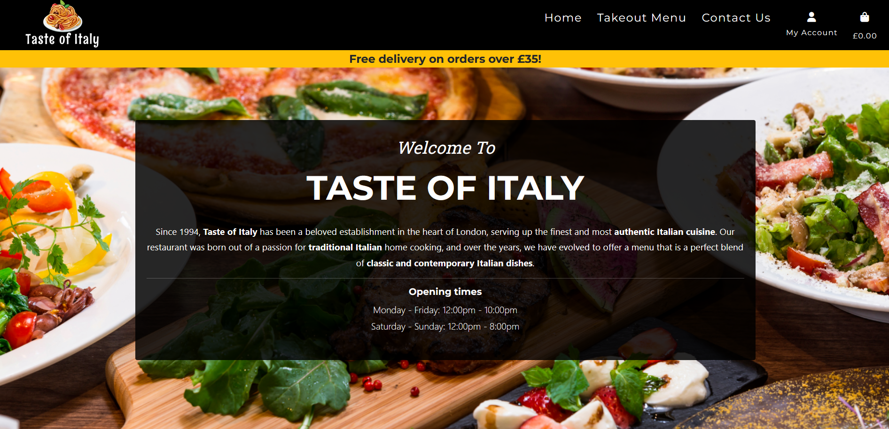
    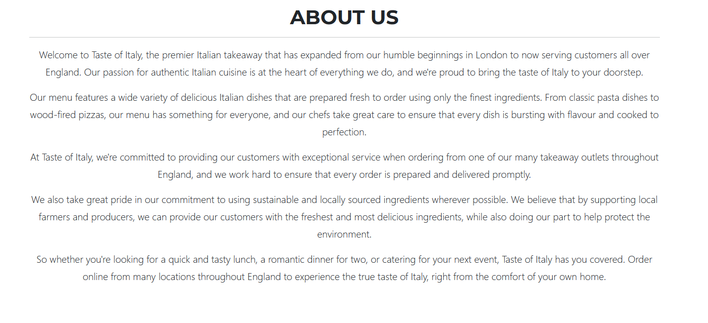
    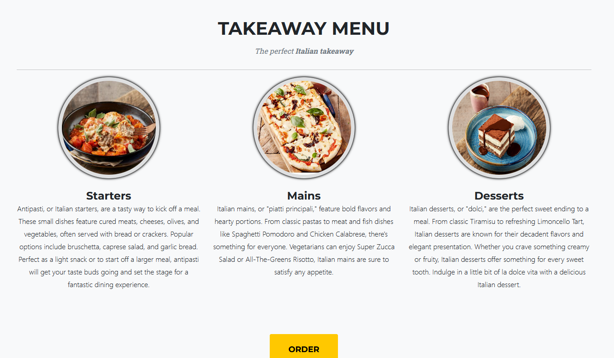
    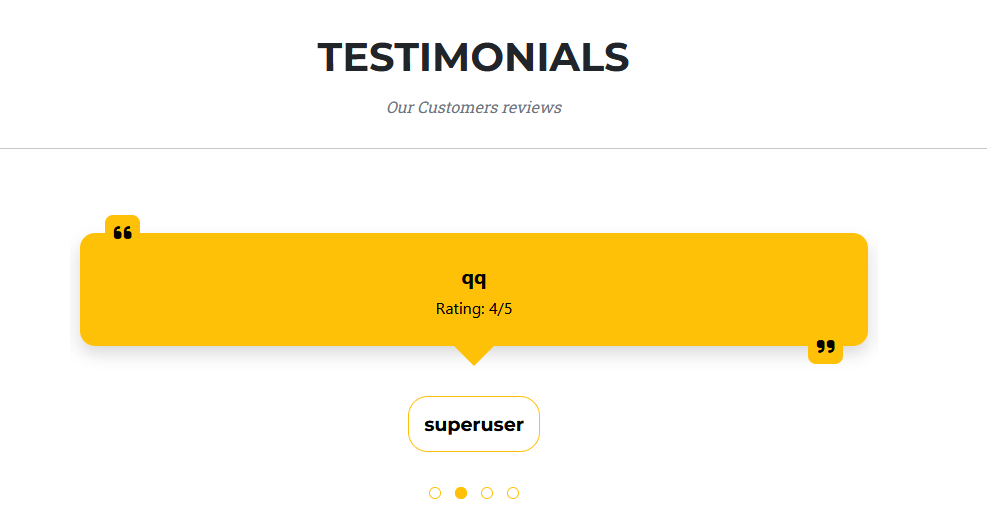

- Takeaway page
    - The takeaway page is divided into 9 categories that represent the food eg. starters or pizza. For quick navigation, there's a navbar at the top which jumps to the category selected by the user.
    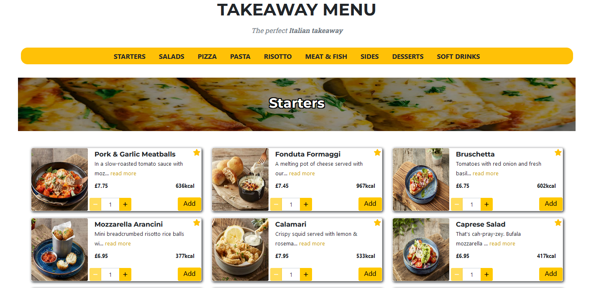
    - Products on the takeaway page are shown on a card with all details such as description - if the description is too long then it will hide and show 'read more' - in addition to the price and calories. With these you also get the option to choose your quantity and then Add a button that adds to the bag, updating the bag total on the nav bar.
    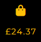

- Bag page
    - After adding products from the takeaway page, they show up on the bag page where users can still update the number of products they want or delete products they don't want anymore.
    - There are 2 buttons, to go back to the menu page in case the user wants to add more products, and a checkout button to navigate to checkout. 
    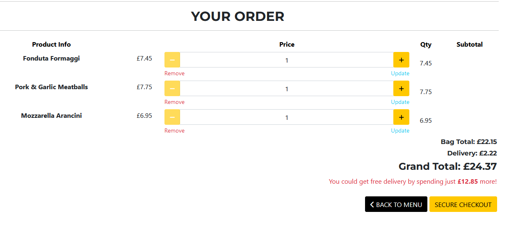

- Checkout page
    - After the user confirms his order in the bag, they will be presented with a checkout page, where there are two sections, one to input delivery and payment details and the second one recaps the user's order. 
    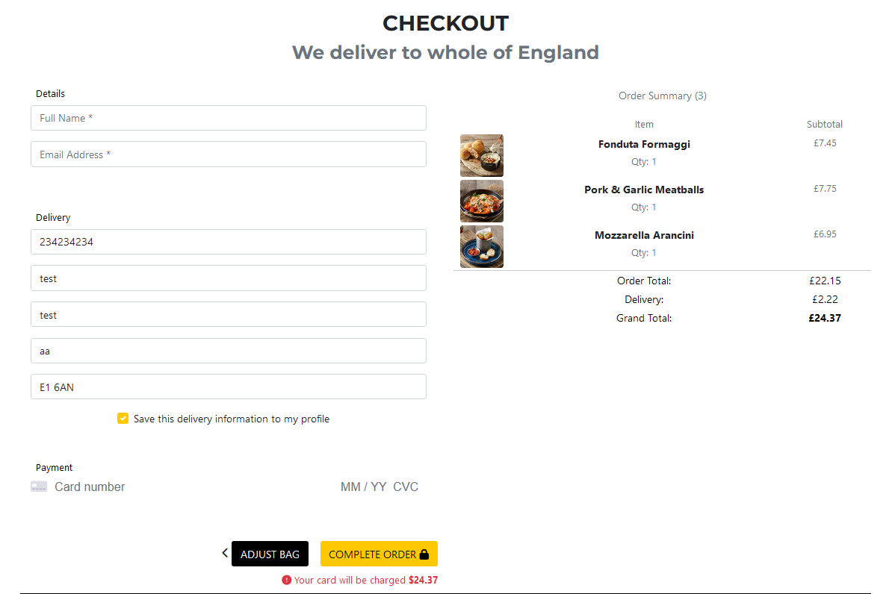
    - If the user is satisfied with his order and inputs the correct details, the page will process his payment via Stripe. After successful payment, the site shows an order summary page confirming the order.
    

- Footer
    - Footer contains a brief repeat of main information such as opening hours, about the company, social media links, and contact us, as well as a newsletter sign-up.
    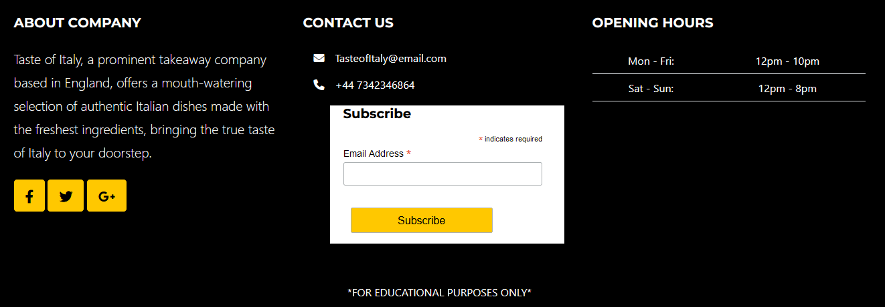

- Superuser Feature
    - Product management
        - Superusers can manage all products that are on the takeaway menu via their product management page. They can edit product details such as description, calories, picture, and price.
        - Products can also be deleted by superusers.
        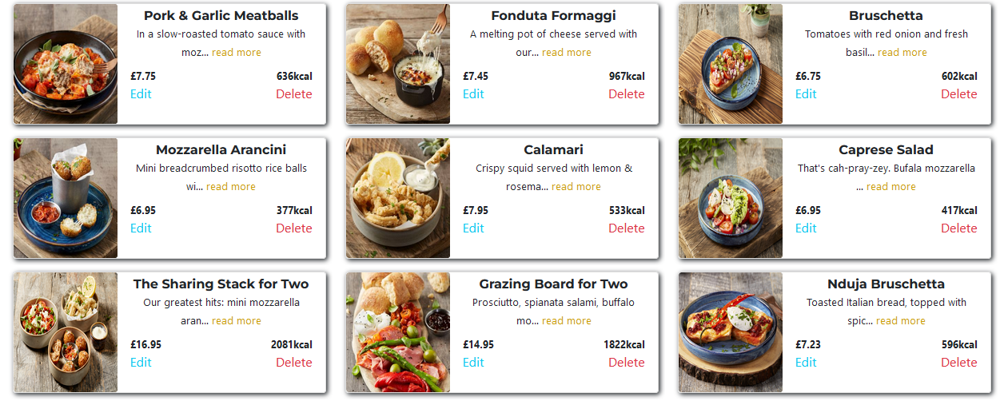
        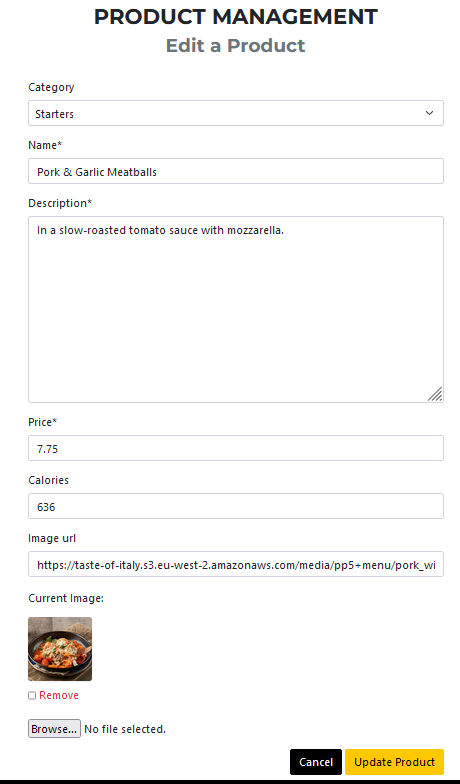
        - Superusers can also add a new product on the "add product" tab in my account. 
        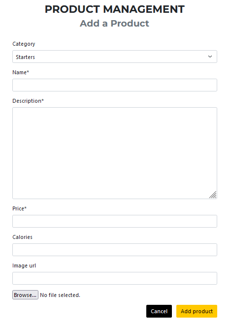

## Future features
    
- The main future feature the website needs is a Google maps API that will pinpoint a user location once entered and could calculate delivery cost depending on what they order and the distance to the location.

- Takeaway menu page refreshes everytime an item is selected which could be inconvinient for users when trying to pick items, future implemntations will need JavaScript to block the refresh and remain were the user is on the page while the items get added to page.

- Update items if they are out of stock, admin can temporarly disable purchasing the item.

## Web marketing

- For web marketing I have used two methods:
    - First method was creating a Facebook page for the company for marketing purposes, this enables the company to post adverts, intresting content and special offers as well as users can engage with the company.  
    
    - Another method used was Newsletter by Mailchimp where customers subscribe for newsletters for any new information, deals, discounts and events.

## Technologies Used

### Code
    
- HTML5
- CSS3 
- JavaScript
- JQuery 
- Python
- Django 

### Programs

- GitHub - Used to create the repository as well as for version control and user stories.
- Heroku - Used to deploy the final website.
- ElephantSQL - Used to store the database.
- Stripe - Used to process the payments.
- AWS S3 - Used for bucket storage for static files and media files.

### Frameworks 

- Django 
- Balsamiq 
- Bootstrap 5 

## Code Validation

### HTML Validation
- Home app + base template - [No errors](https://validator.w3.org/nu/?showsource=yes&doc=https%3A%2F%2Ftaste-of-italy.herokuapp.com%2F)

### CSS Validation 
- The CSS code validator shows no errors, however, there's a lot of errors due to the templates css code that uses vendor extensions for Apple.
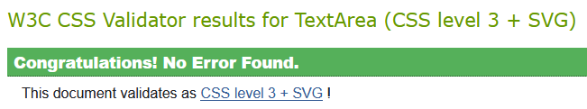

